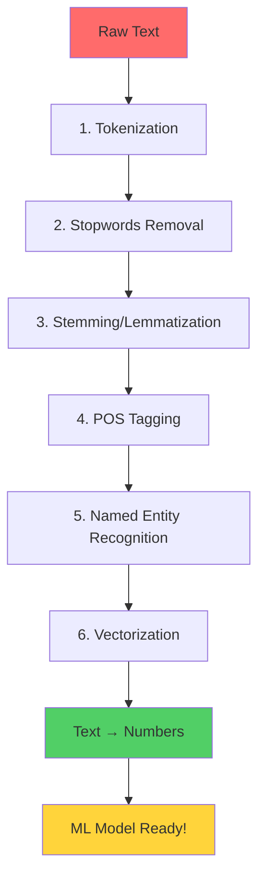

# 05 - Machine Learning for NLP 🤖

> **Goal**: Transform raw text into numbers that ML models can understand

📖 **[Quick Reference Guide](QUICK-REFERENCE.md)** - One-page cheat sheet for revision!  
🗺️ **[Learning Guide](LEARNING-GUIDE.md)** - Visual roadmap and progress tracker!

---

## 📚 What You'll Learn

This chapter teaches you how to prepare text data for machine learning. You'll learn the complete pipeline from raw text to ML-ready features.

```
Raw Text → Clean Text → Numbers → ML Model ✅
```

---

## 🗺️ Learning Path



---

## 📖 Concepts Overview

### 🔹 Text Preprocessing (Notebooks 1-4)

| Step              | What It Does                           | Why It Matters          | Notebook                                  |
| ----------------- | -------------------------------------- | ----------------------- | ----------------------------------------- |
| **Tokenization**  | Breaks text into words/sentences       | Foundation of all NLP   | `1-Tokenization+Example+Using+NLTK.ipynb` |
| **Stemming**      | Cuts words to root form (fast, rough)  | Reduces vocabulary size | `2-Stemming+And+Its+Types.ipynb`          |
| **Lemmatization** | Finds dictionary root (accurate, slow) | Preserves meaning       | `3-Lemmatization.ipynb`                   |
| **Stopwords**     | Removes common words (is, the, a)      | Reduces noise           | `4-Text+Preprocessing-Stopwords.ipynb`    |

**Quick Comparison:**

```
Original:  "The students are eating apples"
After Tokenization:  ["The", "students", "are", "eating", "apples"]
After Stopwords:     ["students", "eating", "apples"]
After Stemming:      ["student", "eat", "appl"]      ❌ Not perfect
After Lemmatization: ["student", "eat", "apple"]     ✅ Perfect!
```

---

### 🔹 Advanced NLP (Notebooks 5-6)

| Technique                    | Purpose                          | Output                 | Notebook                           |
| ---------------------------- | -------------------------------- | ---------------------- | ---------------------------------- |
| **POS Tagging**              | Labels grammar (noun, verb, adj) | (word, tag) pairs      | `5-Parts+Of+Speech+Tagging.ipynb`  |
| **Named Entity Recognition** | Finds real-world entities        | PERSON, LOCATION, DATE | `6-Named+Entity+Recognition.ipynb` |

**Example:**

```
Text: "Elon Musk founded SpaceX in 2002"

POS Tags:
Elon → NNP (Proper Noun)
Musk → NNP (Proper Noun)
founded → VBD (Past Verb)

NER:
Elon Musk → PERSON
SpaceX → ORGANIZATION
2002 → DATE
```

---

### 🔹 Text to Numbers - Vectorization (Notebooks 7-9)

**The Big Challenge**: ML models only understand numbers, not text!

| Method           | How It Works                    | Pros                        | Cons               | Notebook                                    |
| ---------------- | ------------------------------- | --------------------------- | ------------------ | ------------------------------------------- |
| **Bag of Words** | Counts word frequency           | Simple, fast                | Ignores word order | `7-Bag+Of+Words+Practical's.ipynb`          |
| **TF-IDF**       | Weighs important words higher   | Better than BoW             | Still sparse       | `8-TF-IDF+Practical.ipynb`                  |
| **Word2Vec**     | Dense vectors, captures meaning | Best semantic understanding | Needs more data    | `9-Word2vec_Practical_Implementation.ipynb` |

**Visual Comparison:**

```
Sentence 1: "food is good"
Sentence 2: "food is not good"

❌ Bag of Words (treats both similarly):
S1: [food:1, is:1, good:1]
S2: [food:1, is:1, not:1, good:1]  → Almost same!

✅ TF-IDF (weighs words):
S1: [food:0.5, is:0.1, good:0.8]
S2: [food:0.5, is:0.1, not:0.9, good:0.8]  → Better!

🌟 Word2Vec (understands meaning):
good → [0.2, 0.8, 0.3, ...]  (300 dimensions)
great → [0.21, 0.79, 0.31, ...]  ← Similar vectors!
bad → [-0.2, -0.8, 0.1, ...]  ← Opposite direction!
```

---

## 🚀 How to Use These Notebooks

### Prerequisites

```bash
# Activate virtual environment
.\venv\Scripts\activate

# Install required libraries
pip install nltk pandas numpy scikit-learn gensim matplotlib
```

### Learning Order (Follow This!)

1. **Start Here** → `1-Tokenization+Example+Using+NLTK.ipynb`

   - Learn how to break text into pieces
   - Understand sentences vs words

2. **Clean Your Text** → Notebooks 2-4 (in order)

   - Try stemming vs lemmatization side-by-side
   - See which removes more noise

3. **Understand Structure** → Notebooks 5-6

   - Learn grammar patterns
   - Extract meaningful entities

4. **Convert to Numbers** → Notebooks 7-9 (MOST IMPORTANT!)
   - Start simple with Bag of Words
   - Graduate to Word2Vec for best results

### 💡 Practice Tips

- **Run every cell sequentially** - don't skip!
- **Try your own sentences** - test with different examples
- **Compare outputs** - see how each method differs
- **Use the spam.csv dataset** - practice on real data

---

## 🎯 Quick Reference

### When to Use What?

| Task                | Best Method              | Why                         |
| ------------------- | ------------------------ | --------------------------- |
| Spam Detection      | TF-IDF or BoW            | Simple, fast, effective     |
| Sentiment Analysis  | Word2Vec                 | Understands "good" vs "bad" |
| Chatbots            | Lemmatization + Word2Vec | Needs accurate meaning      |
| Search Engine       | Stemming + TF-IDF        | Speed matters               |
| Text Classification | TF-IDF or Word2Vec       | Depends on dataset size     |

### NLP Libraries Covered

| Library          | Purpose               | When to Use              |
| ---------------- | --------------------- | ------------------------ |
| **NLTK**         | Learning & research   | Perfect for beginners ✅ |
| **spaCy**        | Production systems    | Faster, use later        |
| **Gensim**       | Word2Vec & embeddings | Advanced vectorization   |
| **scikit-learn** | ML & vectorization    | BoW, TF-IDF              |

---

## 🔑 Key Takeaways

✅ **Tokenization** is the foundation - without it, nothing else works  
✅ **Lemmatization > Stemming** for accuracy (but slower)  
✅ **Stopwords** reduce noise but be careful with words like "not"  
✅ **Word2Vec** captures meaning - best for modern NLP  
✅ **Always preprocess before vectorization**

### The Complete Pipeline

```python
# Typical NLP workflow
text = "The students are eating apples!"

# 1. Tokenize
words = word_tokenize(text.lower())
# ['the', 'students', 'are', 'eating', 'apples', '!']

# 2. Remove stopwords
words = [w for w in words if w not in stopwords]
# ['students', 'eating', 'apples', '!']

# 3. Lemmatize
words = [lemmatizer.lemmatize(w, pos='v') for w in words]
# ['student', 'eat', 'apple', '!']

# 4. Vectorize (convert to numbers)
vector = model.transform([' '.join(words)])
# Ready for ML! 🎉
```

---

## 📊 What's Next?

After mastering this chapter, you'll be ready for:

- **Deep Learning for NLP** (RNNs, LSTMs)
- **Transformers** (BERT, GPT)
- **Generative AI** (the ultimate goal!)

---

## 🆘 Common Issues

| Problem                   | Solution                                     |
| ------------------------- | -------------------------------------------- |
| `nltk` resource not found | Run `nltk.download('all')` in first notebook |
| Slow lemmatization        | Use stemming for large datasets              |
| Poor Word2Vec results     | Need more training data (or use pre-trained) |
| Out of memory             | Use TF-IDF instead of Word2Vec               |

---

## 📝 Practice Exercise

Try this challenge after completing all notebooks:

**Task**: Build a spam classifier using the `spam.csv` file

1. Load and explore the data
2. Preprocess (tokenize → remove stopwords → lemmatize)
3. Vectorize using TF-IDF
4. Train a simple ML model
5. Compare with Word2Vec approach

**Goal**: Achieve >90% accuracy!

---

**Ready to start?** Open `1-Tokenization+Example+Using+NLTK.ipynb` and let's go! 🚀

---

## 📚 What's in Each Notebook?

All notebooks now include:

✅ **Clear explanations** - What each concept does and why it matters  
✅ **Real examples** - See actual transformations  
✅ **Step-by-step guidance** - Follow along easily  
✅ **Visual markers** - 📌 for important concepts  
✅ **Practical code** - Ready to run and experiment

Each notebook builds on the previous one, creating a complete learning path from basic tokenization to advanced Word2Vec embeddings!

---


\_Previous: [04 - GenAI Overview](../04-genai-overview/README.md) |
